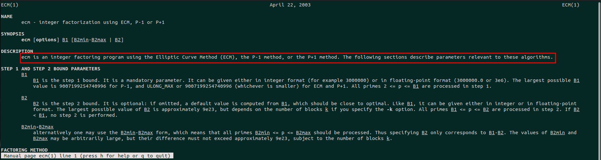

# 1. Challenge Code / Description

[**Grail**](https://snappctf.com/tasks/grail_d142a1301e9e48d2d166735c47cf61d451cb7826.txz) cryptosystem employs elementary math to safeguard valuable secrets. Despite strengths, it harbors vulnerabilities requiring careful consideration.

```python
#!/usr/bin/env python3

from Crypto.Util.number import *
from flag import flag

def make_prime(nbit):
  while True:
    p = 2
    for _ in range(nbit >> 5):
      p *= getPrime(nbit >> 4)
    p += 1
    if isPrime(p):
      return p

def encrypt(msg, pubkey):
  m = bytes_to_long(msg)
  assert m < pubkey
  c = pow(m, 0x10001, pubkey)
  return c

nbit = 512
p = make_prime(512)
q = getPrime(2 * nbit - p.bit_length())

pubkey = p * q ** 2
enc = encrypt(flag, pubkey)

print(f'n = {pubkey}')
print(f'c = {enc}')
```

this challenge is about generating two prime factors and a public modulus `n` like `n = p * q * q` and encrypt a flag with it\
the prime generation part is interesting let's see what's happening


```python
def make_prime(nbit):
  while True:
    p = 2
    for _ in range(nbit >> 5):
      p *= getPrime(nbit >> 4)
    p += 1
    if isPrime(p):
      return p
```

if we look at the algorithm, the prime generation isn't trivial safe method and is like this

```python
p,q = x1 * x2 * x3 * x4 * x5 * ... * x16 + 1
2**31 < x1,x2,x3,...x16 < 2**32
```

in mathematics we call these numbers smooth numbers. in another words both `p-1` and `q-1` have prime factors less than `4294967296` which are called 32-bit smooth numbers. you can read about smooth numbers [here](https://en.wikipedia.org/wiki/Smooth_number).\
using of smooth numbers when generating prime factors is not a safe idea. because there is an algorithm called **pollard p-1** which is about factoring a composite number `n` while all its prime factors `p-1` are  power-smooth. and this smoothness is not that large (here it is 32 bit which is reasonable) 

# 2. Solution

By definition 
```
Further, m is called B-powersmooth (or B-ultrafriable) if all prime powers p**v dividing m satisfy:

p**v <= B
```

Here we can use `Pollard's p − 1` algorithm because our integer `n`'s factor `p-1`,`q-1` are `4294967296-smooth` which satisfies our conditions.

## Pollard's p − 1 Algorithm

Here are the overall steps:

1. select a smoothness bound `B` (we should use `4294967296`)
2. choose a random base `a` co-prime to `n`
3. define `M = factorial(B)`
4. compute `g = gcd(a**M - 1, n)`
5. if `1 < g < n` then `g` is one of the factors
6. if `g == 1` select larger `B` and try again
7. if `g == n` select smaller `B` and try again

## Pollard's p − 1 Algorithm's proof

Let's see how this algorithm works

### Fermat's Little Theorem
We know that for every prime number `p` and a random number `a` co-prime to `p` we can write
```python
a**(p-1) % p = 1
or
a**(p-1) -1 = p*r
```
In other words `a**(p-1) - 1` has two factors `p,r` and `p` is prime\
We can also multiply `p-1` with `k`:
```python
a**[k*(p-1)] % p = 1
or
a**[k*(p-1)] -1 = p*s
```

### The proof
From previous equations we can conclude:
```python
gcd(a**[k*(p-1)]-1 = p*s, n) = p
B = k*(p-1)
gcd((a**B)-1, n) = p
```

$\text{gcd}(a^{k \cdot (p-1)} - 1, n) = p$
$\text{B} = k \cdot (p-1)$
$\text{gcd}(a^B - 1, n) = p$

If we can calculate `B` and choose any integer `a` co-prime to `n`(2 is the best choice), then we can find `p` with `gcd` operation. simple huh?! But how to find `B`\
We know that:
```python
B = k*(p-1)
p-1 = p1 * p2 * p3 ... * px
```

And we know that `p-1` is `power-smooth` which means that all factors of `p-1`(`p1, p2, ..., px`) are less than `4294967296`\
So if we choose `B=1*2*3*4*...*4294967296` and calculate that we can assure that `B` has `p` inside its factor and gcd of `a**B - 1` with `n` will result in `p` which is one of the factors.

All sounds cool! but is it easy to calculate `factorial(4294967296)` specially in python? definitely not! it will take a looong time and memory to find those primes. instead of that I used ecm utils, which is a powerful and optimal integer factorization tools, you can also use yafu which it also uses ecm.

if we look at the man page of ecm we see we can use it for special purposes like pollard p-1 algorithm



how to use ecm for our goal, if we look at **Two-stage variant** of this [link](https://en.wikipedia.org/wiki/Pollard%27s_p_%E2%88%92_1_algorithm) we see that there is another variant for pollard p-1 algorithm which are for composite numbers that their prime factors `p-1` have two different boundaries for their prime factors one is B1 an the other is B2. if we look at the man page of ecm it implements this utility by providing two boundaries `B1` and `B2`. because we only have one boundary here (`2**32`) we can put equal value for both of them and use it for our goal

so we're gonna use ecm with two equal boundaries
```bash
➜  ~ echo 60271408980729933877006968813908832767217070740159093498648400768736607939292481938381401022966688543630910474432361244613651991411572432214753910349772891370476918909077112530540621911383966658026593134345274324134753562637349391036182588852497718523479144409580717389609520235592399501427008877619567949880750992502426829388092423290210227355740274649904830512823177150165653995357199403968315206581509860688738386215498703336824919554943205899149182547563125887 | ecm -pm1 4294967296 4294967296
GMP-ECM 7.0.4 [configured with GMP 6.2.1, --enable-asm-redc] [P-1]
Input number is 60271408980729933877006968813908832767217070740159093498648400768736607939292481938381401022966688543630910474432361244613651991411572432214753910349772891370476918909077112530540621911383966658026593134345274324134753562637349391036182588852497718523479144409580717389609520235592399501427008877619567949880750992502426829388092423290210227355740274649904830512823177150165653995357199403968315206581509860688738386215498703336824919554943205899149182547563125887 (464 digits)
Using B1=4294967296, B2=4294967328, polynomial x^1, x0=4248787747
Step 1 took 5257888ms
********** Factor found in step 1: 167728479569738446790816571231448658833096894670942318978681577866959239045827693247942471269483925051228192824546223068950392538581153723850180934954663
Found prime factor of 153 digits: 167728479569738446790816571231448658833096894670942318978681577866959239045827693247942471269483925051228192824546223068950392538581153723850180934954663
Composite cofactor 359339148219430319280089093265239884758034574636452597711238478104459134171973120770298288584658864887725190578210632161098277750292496622577052826229137258086647336771350031270088547539336870855964992863875205318437496664120219095344484150789429241919483604923061620946207848824960877467377903440365432510559849 has 312 digits
Report your potential champion to Paul Zimmermann <zimmerma@loria.fr>
(see http://www.loria.fr/~zimmerma/records/Pminus1.html)
```


excellent, we found the prime factor `p` and a composite factor which is `q**2`\
now let's write our final code to decrypt the flag. To be honest there is no nee to calculate `q`. with just `p` and its relevant `d` you can find the flag because this is a `3-prime` variant of RSA.

```bash
echo 60271408980729933877006968813908832767217070740159093498648400768736607939292481938381401022966688543630910474432361244613651991411572432214753910349772891370476918909077112530540621911383966658026593134345274324134753562637349391036182588852497718523479144409580717389609520235592399501427008877619567949880750992502426829388092423290210227355740274649904830512823177150165653995357199403968315206581509860688738386215498703336824919554943205899149182547563125887 | ecm -pm1 4294967296 4294967296
p = 167728479569738446790816571231448658833096894670942318978681577866959239045827693247942471269483925051228192824546223068950392538581153723850180934954663
```


```python
from Crypto.Util.number import *

n = 60271408980729933877006968813908832767217070740159093498648400768736607939292481938381401022966688543630910474432361244613651991411572432214753910349772891370476918909077112530540621911383966658026593134345274324134753562637349391036182588852497718523479144409580717389609520235592399501427008877619567949880750992502426829388092423290210227355740274649904830512823177150165653995357199403968315206581509860688738386215498703336824919554943205899149182547563125887
c = 18438522198977155755872369073173517918203417931951458175663749127772053822610354477488382931648204112363708747300333279964863287907821749491918178632833296879643102108322183879396960621080385271708526432735445408218922762232344776571397157271654216251665202720050665755807242355490753461576547890363093564721184099967652686729464944824967135201979335166915502492388799588271020179969104407201131683522897318106586922050389249019689732226480944822582494823555270535
e = 0x10001

p = 167728479569738446790816571231448658833096894670942318978681577866959239045827693247942471269483925051228192824546223068950392538581153723850180934954663

assert (n % p) == 0
dp = pow(e, -1, p-1)

mp = pow(c, dp, p)
print(long_to_bytes(mp).decode())
```

