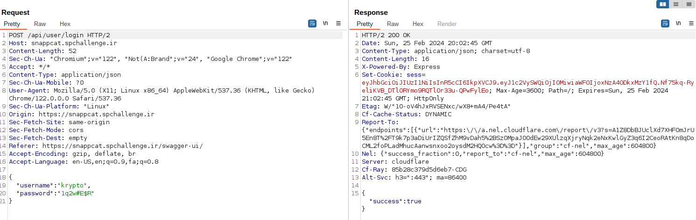
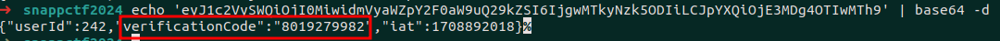
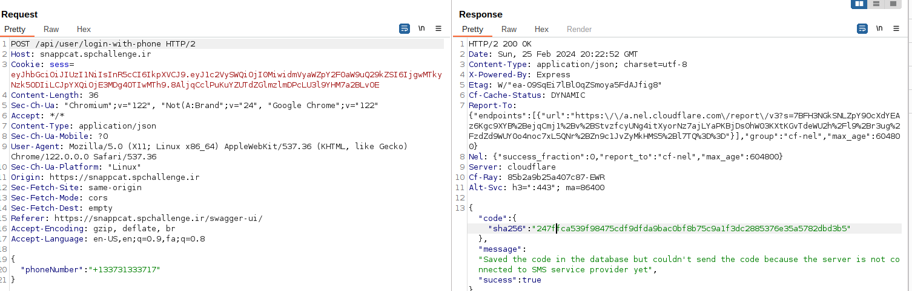
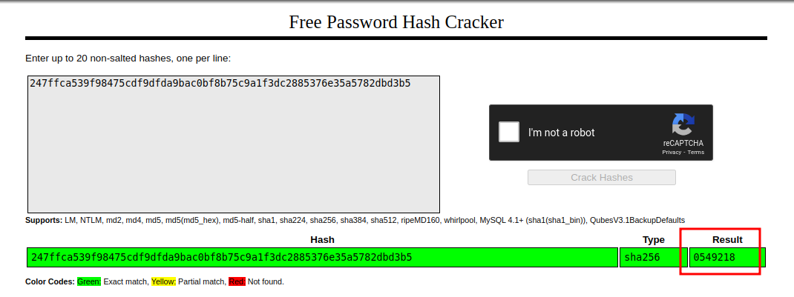
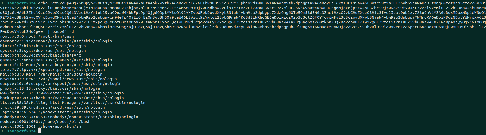

# Snapp cat

First of all when we browse the given url we're faced with a swagger documentation. 
I tried to call some of them but all seemed to require authentication except the register and login endpoints.
So I tried the register endpoint and found out that the required phone number format is as follows: +123456789012
I registered an account using the required values and logged in to the application and got a authentication token.
Afterwards, I tried to access /api/user/1 but it needed my email to be verified. I called the email verification and got the new email verified token.
Then I called the /api/user/1 endpoint and it returned some information like username and phone number of admin.
After that I called /api/user/login-with-phone endpoint with the Admin's phone number and it returned th sha256 hash of OTP.
I cracked the hash and logged in as admin user.
Now that I had the admin privilege I tried to access /api/cat/random-cat-image endpoint and it generated a uuid for me.
Then I called /api/cat/create with random values and it showed me an error saying that an error has been occured in /app/index.js. I gave the /app/index.js as input to imagePath parameter and then tried to get the file from /api/cat/{catId}.
It returned the base64 encoded index.js file. I noticed an endpoint like /secret and tried to call it but it didn't work. So I took a closer look and noticed that a claim should be set in my JWT that isn't set by default. So I took the JWT secret from index.js file and generated a new token with required property and called the secret endpoint again. 
Finally I was awarded with the flag.

# Solution

1. register


2. login



3. login with phone


4. crack hash


5. send login code


6. email verification


7.  get verification code from session


8. send email verification code


9. get admin info


10. login with admin phone


11. crack admin login code


12. send admin login code


13. become admin


14. random cat


15. create cat with path /etc/passwd


16. get data


17. /etc/passwd data read


18. get /app/index.js


19 get flag with new jwt secret


```
SNAPP{7dc998269394314896af6378f15c2c12}
```